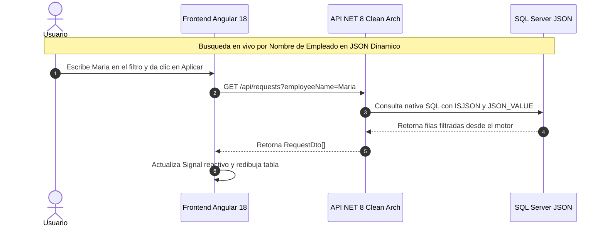
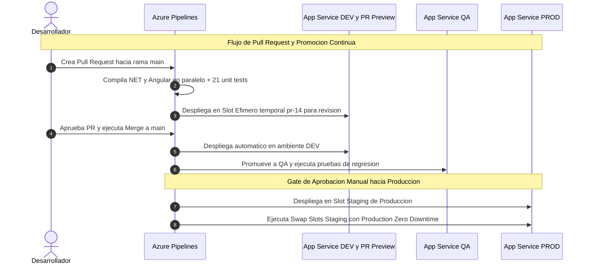

# WTW Request Platform — Evaluación Liderazgo Técnico

Este repositorio contiene mi propuesta de arquitectura e implementación para la plataforma interna de gestión de solicitudes (vacaciones, préstamos y permisos), desarrollada como parte de la prueba técnica para el rol de **Lider de Integracion**.
---

## 1. Estructura del Proyecto

```
wtw-tl-test/
├── backend/                        # API .NET 8 
├── frontend/request-platform/      # SPA Angular 18 
├── sql/                            # Script de base de datos con datos de prueba
├── azure-pipelines.yml             # CI/CD Pipeline multi-stage (Trunk-Based)
├── devops-strategy.md              # Estrategia de ambientes, secrets y rollback 
└── liderazgo-tecnico.md            # Respuestas a preguntas de liderazgo y gestión
```

---

## 2. Guía de Ejecución Local

### Paso 1: Base de datos SQL Server (Docker)
Levanta el contenedor de base de datos e inicializa el esquema con los datos de prueba incluidos:

```bash
# 1. Iniciar contenedor de SQL Server 2022
docker run -e "ACCEPT_EULA=Y" -e "MSSQL_SA_PASSWORD=WtwTest1708*$" \
  -p 1433:1433 --name sql-wtw -d mcr.microsoft.com/mssql/server:2022-latest

# 2. Ejecutar script de inicialización (Crea tablas, datos de prueba)
docker exec -i sql-wtw /opt/mssql-tools18/bin/sqlcmd \
  -S localhost -U sa -P "WtwTest1708*$" -C < sql/init.sql
```

### Paso 2: Backend API (.NET 8)
Abre una terminal y ejecuta la API y su suite de pruebas automáticas:

```bash
cd backend

# 1. Compilar y correr pruebas unitarias
dotnet test

# 2. Levantar servidor local
dotnet run --project src/RequestPlatform.API
```
La API escuchará en `http://localhost:5062`. Puedes abrir `http://localhost:5062/swagger` para explorar los endpoints

### Paso 3: Frontend Web (Angular 18)
Abre otra terminal para correr el servidor de desarrollo web:

```bash
cd frontend/request-platform

# 1. Instalar node modules
npm install

# 2. Levantar frontend
npm run start
```
Ingresa a **`http://localhost:4200`** desde tu navegador.

---

## 3. Diagramas de Flujo y Arquitectura (Mermaid)

### Flujo de Aplicación: Búsqueda Activa en SQL Server JSON
Muestra cómo interactúan Angular 18 (Signals), la API .NET 8 y el motor SQL Server cuando se consulta dinámicamente el campo dentro del JSON:



### Flujo DevOps CI/CD: Promoción por Entornos y Zero-Downtime
Muestra el recorrido completo desde la creación de un Pull Request con ambientes efímeros hasta la promoción a Producción mediante Blue-Green Slot Swap:



---

## 4. Documentación Adjunta
* **`devops-strategy.md`**: Detalla el flujo de promoción lineal (`PR-Preview` → `DEV` → `QA` → `PROD`), gestión de secretos sin código en Azure Key Vault y mecanismos de rollback instantáneo en menos de 5 segundos.
* **`liderazgo-tecnico.md`**: Presenta mis respuestas detalladas y resolución de conflictos ante los 6 escenarios de gestión del equipo.
